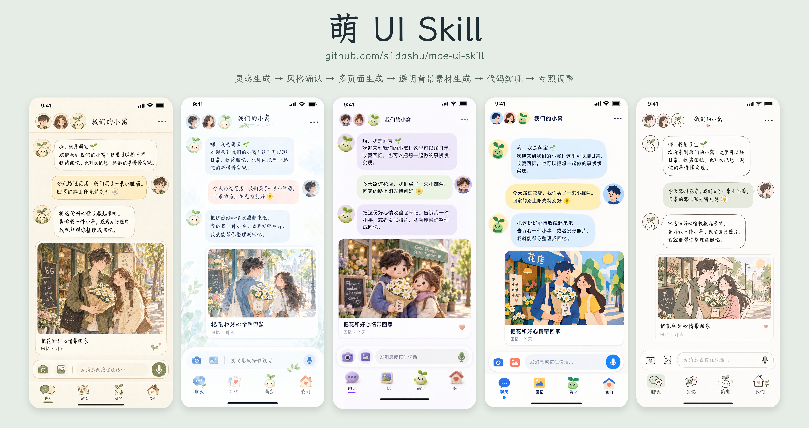
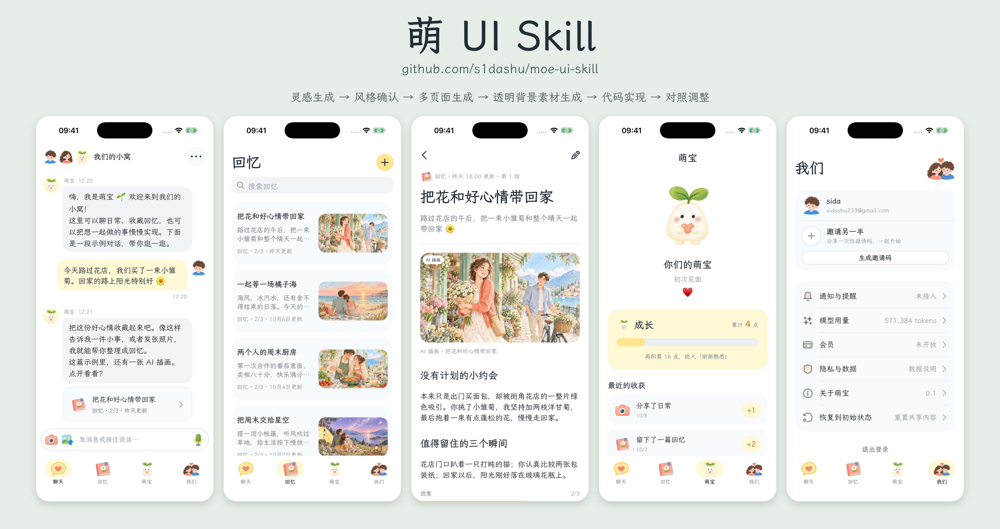

# 萌 UI Skill

让 AI Agent 帮你做出可爱、有统一风格、真正可交互的 App 与 Web 界面。从视觉探索开始，一步步完成页面设计、插画素材和代码实现。

## 效果展示

六种预设风格：清新蜡笔、奶油彩铅、轻盈水彩、柔软毛毡、极简纸艺、温柔线描。也可以从你提供的参考图或者你的任意灵感开始。

**不同风格效果示例**



**清新蜡笔风格，完整应用实机截图**



## 核心流程

**灵感生成 → 风格确认 → 多页面生成 → 透明背景素材生成 → 代码实现 → 对照调整**

先选喜欢的风格，确认产品第一页，再扩展其他页面。插画、头像和图标分别生成，文字、布局与交互由真实组件实现，最后对照设计稿调整。

## 安装

```bash
npx skills@latest add s1dashu/moe-ui-skill
```

按提示选择 Agent 即可安装，包含全部风格预览与提示词。添加 `--global` 可供所有项目使用：

```bash
npx skills@latest add s1dashu/moe-ui-skill --global
```

## 推荐搭配

推荐搭配 **Codex**，或接入 **GPT Image、Gemini Image 等最新生图模型**的 Agent 使用。Agent 需要具备图像生成与编辑、文件操作和代码实现能力。

效果取决于 Agent 与生图模型的能力，其他组合的效果不作保证。

安装后，可以直接对 Agent 说：

> 使用萌 UI Skill，先为我的产品展示几种风格，再生成首页预览。

## 开源协议

[MIT](LICENSE)
